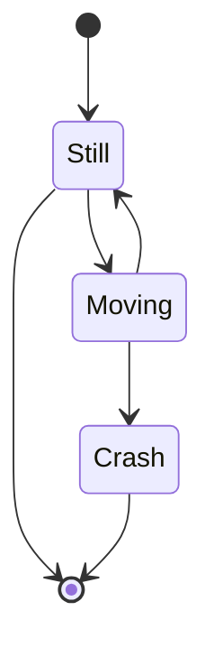

Simulador interactivo de respuesta reflejo ovulo vestibular

Sirrov es un simulador del movimiento ocular y la respuesta vestibular frente a pruebas caloricas, movimientos rotacionales. El hardware esta basado en raspberri py pero es perfectamente utilizable en otras plataformas que admitan python, sdl, y la posibilidad de conectar dos pantallas spi, a continuación una descripción del equipo en cuestión:

